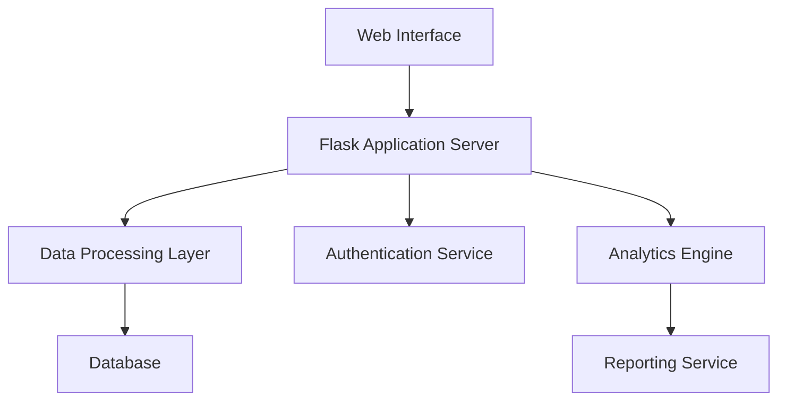

# Technical Documentation - CLV Analytics Platform

## System Architecture

### Component Overview


## Core Components

### 1. CLV Calculator (`clv_calculator.py`)
The CLV calculator implements sophisticated algorithms to compute customer lifetime value based on:
- Historical transaction data
- Purchase frequency
- Average order value
- Customer lifespan
- Churn probability

Implementation details:
```python
def calculate_clv(customer_id):
    # Retrieves historical transactions
    # Calculates purchase frequency
    # Computes average order value
    # Estimates customer lifespan
    # Applies retention probability
    # Returns calculated CLV
```

### 2. Product Analytics (`product_analytics.py`)
Handles product performance analysis and lifecycle tracking:
- Product performance metrics
- Sales trend analysis
- Lifecycle stage determination
- Customer behavior correlation

Key functions:
```python
def analyze_product_lifecycle(product_id):
    # Determines product lifecycle stage
    # Analyzes sales trends
    # Tracks customer adoption
    # Returns lifecycle metrics

def calculate_product_metrics(product_id):
    # Computes revenue metrics
    # Analyzes customer segments
    # Tracks performance indicators
    # Returns product performance data
```

### 3. Retention Manager (`retention_manager.py`)
Manages customer retention analysis and risk assessment:
- Churn prediction
- Risk level calculation
- Engagement scoring
- Retention strategy recommendations

### 4. Data Quality System (`check_transactions.py`, `check_db.py`)
Ensures data integrity and quality:
- Transaction validation
- Data consistency checks
- Error detection
- Quality metrics tracking

## Database Schema

### Core Tables
```sql
-- Customers Table
CREATE TABLE customers (
    id INTEGER PRIMARY KEY,
    name TEXT NOT NULL,
    segment TEXT,
    status TEXT,
    last_transaction_date DATE,
    clv DECIMAL(10,2)
);

-- Products Table
CREATE TABLE products (
    id INTEGER PRIMARY KEY,
    name TEXT NOT NULL,
    category TEXT,
    lifecycle_stage TEXT
);

-- Transactions Table
CREATE TABLE transactions (
    id INTEGER PRIMARY KEY,
    customer_id INTEGER,
    product_id INTEGER,
    amount DECIMAL(10,2),
    date DATE,
    FOREIGN KEY (customer_id) REFERENCES customers(id),
    FOREIGN KEY (product_id) REFERENCES products(id)
);
```

## Authentication System

### Session Management
- Flask-Session for server-side session storage
- Secure session configuration
- Session timeout handling
- Anti-tampering measures

### Security Implementation
```python
# Session Configuration
app.config['SESSION_TYPE'] = 'filesystem'
app.config['PERMANENT_SESSION_LIFETIME'] = timedelta(hours=2)
app.config['SESSION_COOKIE_SECURE'] = True
app.config['SESSION_COOKIE_HTTPONLY'] = True
```

## Frontend Architecture

### Template Structure
```
templates/
├── base.html          # Base template with common elements
├── landing.html       # Landing page
├── dashboard.html     # Main dashboard
├── clients.html       # Client management
├── products.html      # Product analytics
└── reports.html       # Reporting interface
```

### JavaScript Modules
- Client-side validation
- Dynamic UI updates
- Data visualization
- AJAX request handling

### CSS Framework (TailwindCSS)
- Responsive design
- Custom theme variables
- Component styling
- Utility classes

## API Endpoints

### Customer Management
```python
@app.route('/clients', methods=['GET'])
def get_clients():
    # Retrieves paginated client list
    # Applies filters and search
    # Returns JSON response

@app.route('/client/<id>', methods=['GET'])
def get_client_details(id):
    # Fetches detailed client information
    # Includes transaction history
    # Returns client profile data
```

### Product Analytics
```python
@app.route('/products', methods=['GET'])
def get_products():
    # Lists all products
    # Includes performance metrics
    # Returns product data

@app.route('/product-lifecycle', methods=['GET'])
def get_lifecycle_data():
    # Analyzes product lifecycle stages
    # Generates performance metrics
    # Returns lifecycle analysis
```

## Error Handling

### Global Error Handlers
```python
@app.errorhandler(404)
def not_found_error(error):
    return render_template('errors/404.html'), 404

@app.errorhandler(500)
def internal_error(error):
    db.session.rollback()
    return render_template('errors/500.html'), 500
```

### Custom Exception Classes
```python
class DataValidationError(Exception):
    pass

class CalculationError(Exception):
    pass
```

## Performance Optimization

### Database Optimization
- Indexed queries
- Connection pooling
- Query caching
- Regular maintenance

### Caching Strategy
```python
# Flask-Caching configuration
cache = Cache(app, config={
    'CACHE_TYPE': 'filesystem',
    'CACHE_DIR': 'cache',
    'CACHE_DEFAULT_TIMEOUT': 300
})

@cache.memoize(timeout=300)
def get_customer_metrics(customer_id):
    # Computes and caches customer metrics
    pass
```

## Deployment

### Production Configuration
```python
# Production settings
DEBUG = False
TESTING = False
DATABASE_URI = 'production_db_uri'
SECRET_KEY = 'production_secret_key'
```

### Server Requirements
- Python 3.x
- SQL Database
- Web Server (e.g., Nginx)
- WSGI Server (e.g., Gunicorn)

### Monitoring
- Application logging
- Error tracking
- Performance metrics
- Resource utilization

## Testing

### Unit Tests
```python
def test_clv_calculation():
    # Tests CLV calculation accuracy
    # Validates edge cases
    # Verifies calculation components

def test_data_validation():
    # Checks input validation
    # Tests error handling
    # Validates data integrity
```

### Integration Tests
- API endpoint testing
- Database integration
- Authentication flow
- End-to-end scenarios

## Maintenance Procedures

### Database Maintenance
1. Regular backups
2. Index optimization
3. Query performance monitoring
4. Data archival

### System Updates
1. Dependency updates
2. Security patches
3. Feature deployments
4. Configuration management

## Security Measures

### Data Protection
- Input sanitization
- Parameter validation
- SQL injection prevention
- XSS protection

### Authentication Security
- Password hashing
- Session management
- Access control
- CSRF protection

## Troubleshooting Guide

### Common Issues
1. Database connection errors
2. Authentication failures
3. Performance degradation
4. Data inconsistencies

### Debug Procedures
1. Log analysis
2. Error tracking
3. Performance profiling
4. Database diagnostics

## Development Guidelines

### Code Style
- PEP 8 compliance
- Documentation standards
- Type hints usage
- Code organization

### Version Control
- Git workflow
- Branch naming
- Commit messages
- Code review process

## Future Enhancements

### Planned Features
1. Machine learning integration
2. Advanced analytics
3. API expansion
4. Mobile support

### Technical Debt
1. Code refactoring
2. Performance optimization
3. Test coverage
4. Documentation updates
